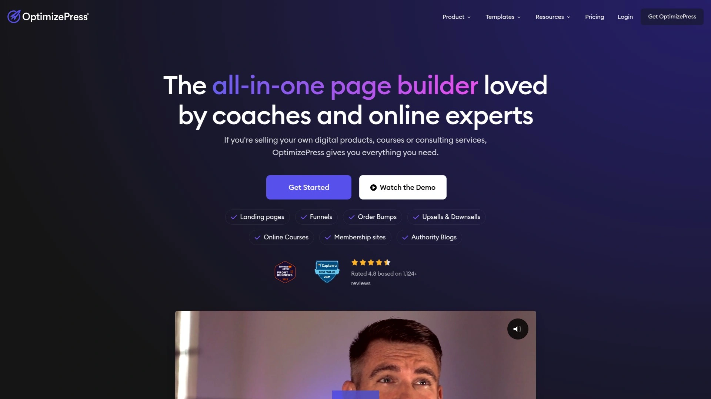

# Top 15 Best Website Builder Tools in 2025

Building a website used to mean hiring a developer who'd disappear for three months and come back with something that looked like it was designed in 2008. Now you can drag boxes around a screen until things look decent, hit publish, and boom—you're live. Whether you're launching a portfolio that actually shows your work instead of burying it in PDFs, setting up an online store that doesn't make customers feel like they're shopping in a digital basement, or creating a landing page that converts better than your old "contact us" form, the right website builder removes the coding barrier between your vision and a functioning site.

This breakdown covers tools that let you design visually instead of staring at code editors, work faster with pre-built templates that don't all look identical, and maintain your site without calling your developer friend every time you need to change a headline.

***

## **[Elementor](https://elementor.com)**

Complete WordPress website builder combining drag-and-drop design, full theme customization, and marketing tools in one platform without switching between multiple plugins.

Elementor powers over 18 million live websites and processes a new site launch every 15 seconds. The platform works as both a page builder for individual content and a complete site builder that designs headers, footers, product pages, and blog templates globally. You're getting 100+ widgets covering everything from basic text blocks to advanced forms, pricing tables, countdown timers, and WooCommerce integrations.

**Why agencies use it:** The theme builder lets you create custom layouts once and apply them site-wide, so changing your header design updates across every page instantly rather than editing 47 individual pages. Global widgets work the same way—design a testimonial card template, mark it global, and updates reflect everywhere it appears. For client sites, this means faster builds and easier maintenance when they inevitably want to "just change one small thing everywhere".

The visual editor shows exactly what you're building in real-time. Hover over any element, click to edit, and your changes appear immediately without preview mode delays. Responsive controls let you adjust layouts specifically for desktop, tablet, and mobile breakpoints, hiding elements on mobile that clutter small screens or stacking sections vertically when horizontal layouts break on phones.

**Marketing integration:** Built-in form builders connect directly to email platforms, popup builders create exit-intent offers and email capture overlays, and landing page templates optimize for conversions rather than just looking pretty. The free version includes core building tools and basic widgets, while Pro adds theme builder access, popup functionality, WooCommerce builder, and the complete template library.

Pricing starts free for the plugin, with Pro at $59 annually for one site or $199 for agency unlimited site licenses. The platform includes hosting options if you want integrated infrastructure, or works with any WordPress host you prefer.

***

## **[Divi Builder](https://www.elegantthemes.com)**

All-in-one WordPress builder with AI content generation, extensive template library, and visual design tools focused on giving you everything needed without installing dozens of separate plugins.

Divi includes both the Divi Theme and Divi Builder plugin, working either together or separately with any WordPress theme. The builder comes with 2,000+ pre-designed layouts across 200+ website packs covering industries from restaurants to consulting firms. You're getting 46 content modules—not quite as many as Elementor's 100+ widgets, but covering the essential building blocks most sites actually use.

**Divi AI integration:** Type what you want and the AI generates entire page layouts, writes copy in your specified tone, creates images, or produces custom CSS code. This works differently than generic AI tools because it understands Divi's structure, generating content that fits directly into your design rather than dumping raw text you need to manually format. The AI can rewrite existing content in different voices—turning formal copy conversational or expanding bullet points into full paragraphs.

The Theme Builder creates custom headers, footers, blog post layouts, and WooCommerce templates with full visual control. Hover effects, motion animations, shape dividers, and scroll effects add interaction without touching JavaScript. Global modules save designed elements for reuse across pages—create a styled contact form once, mark it global, and updates apply everywhere automatically.

**Performance considerations:** Divi historically loaded slower than lightweight builders like Bricks or Oxygen, though recent versions improved significantly. If speed tops your priority list and you're willing to sacrifice some ease-of-use for performance, consider leaner alternatives. But for feature-rich building with minimal plugin installation, Divi consolidates functionality other builders require third-party add-ons to achieve.

Pricing runs $89 annually or $249 lifetime for unlimited site usage, including Divi Theme, Divi Builder, and access to all premium layouts. The membership also covers other Elegant Themes products and updates.

***

## **[Beaver Builder](https://www.wpbeaverbuilder.com)**

Developer-friendly WordPress builder emphasizing clean code output, stable performance, and professional workflow features like client editor mode and granular user role permissions.

Over one million websites run on Beaver Builder, known particularly among agencies and freelancers who value reliability over flashy features. The platform includes 50+ pre-designed templates and 30 content modules—fewer than Divi or Elementor but carefully chosen to cover core functionality without bloat. Front-end editing shows changes in real-time as you build, with a straightforward interface that displays section layouts clearly when hovering over elements.

**Why developers choose it:** The code output stays clean and semantic, making it easier to troubleshoot or hand off projects to other developers. Beaver Themer extends the base builder with custom header, footer, and archive template functionality similar to Elementor's theme builder or Divi's layout system. User role editing lets you specify permission levels when working with teams—restrict clients to editing only specific sections while blocking them from breaking the entire site layout.

Client Editor Mode simplifies the interface for non-technical users, showing only the settings they need to update content safely. This matters when handing sites to clients who'll panic if they see too many options. Assistant Pro adds cloud storage for saving templates and deploying them across multiple projects directly from the builder.

**Performance profile:** Beaver Builder loads faster than Divi while offering more features than bare-bones builders, landing in a sweet spot for balanced functionality and speed. It works smoothly with most WordPress themes and plugins without the compatibility conflicts that plague some page builders. The platform targets professionals building sites for clients rather than DIY site owners, reflected in its focus on workflow features over beginner handholding.

Pricing starts at $99 annually for standard package, $199 for pro with white labeling and multisite support, or $399 for agency including Beaver Themer and unlimited site usage.

***

## **[Webflow](https://webflow.com)**

Code-to-visual website builder designed for designers and agencies who want pixel-perfect control and advanced customization without WordPress, hosting everything on Webflow's infrastructure.

Webflow sits between traditional page builders and coding—you're designing visually but with access to CSS properties, animations, and layout controls that mirror hand-coding capabilities. The platform includes hosting, CMS, and ecommerce functionality in one system, so you're not installing WordPress, finding hosting, connecting domains across multiple dashboards. Sites built on Webflow typically load extremely fast because the platform compiles your design into clean production code rather than loading a builder framework on every page.

**Designer-centric workflow:** The interface exposes flexbox, grid layouts, and responsive breakpoint controls that feel natural if you understand CSS concepts. Interactions and animations run on a timeline editor similar to motion graphics software, letting you create scroll-triggered effects, hover states, and page transitions without JavaScript. For non-technical users, this complexity becomes overwhelming—Webflow has the steepest learning curve on this list.

The CMS manages dynamic content like blogs, portfolios, or product catalogs with custom fields and collection templates. Webflow University provides extensive video tutorials covering everything from basics to advanced techniques, necessary because the platform requires real learning investment. Collaboration features support team workflows with editor roles, comments, and staging environments.

**Trade-offs:** You're locked into Webflow's ecosystem—no exporting to self-hosted infrastructure without losing CMS functionality and rebuilding from exported code. Pricing runs higher than WordPress builders, starting around $18 monthly for basic sites and scaling quickly for ecommerce or high-traffic projects. Best for design agencies, web professionals with CSS knowledge, or businesses willing to invest in learning for the payoff of exceptional design control.

***

## **[Wix](https://www.wix.com)**

All-in-one website platform offering extreme ease-of-use with drag-and-drop freedom, complete hosting infrastructure, and built-in business tools for entrepreneurs who want simplicity over technical flexibility.

Wix lets you place elements literally anywhere on the page—text boxes, images, buttons float freely rather than snapping to grid constraints. This absolute positioning makes designing feel intuitive but can create responsive design challenges when layouts need to adapt across screen sizes. The platform handles hosting, security, backups, and updates automatically, removing all technical maintenance.

**Business features included:** Email marketing tools, appointment booking systems, restaurant menus with online ordering, event management, and basic ecommerce functionality come built-in without installing separate apps. The App Market extends functionality further with hundreds of integrations covering everything from live chat to advanced analytics. Wix ADI (Artificial Design Intelligence) can generate complete site designs by asking you questions about your business, though custom building from scratch offers more control.

Templates number in the hundreds, organized by industry and business type. Once you select a template, you're somewhat committed—switching templates later requires rebuilding content rather than seamlessly transferring it. SEO capabilities exist but with less granular control than WordPress or Webflow, which matters more as sites grow and SEO becomes critical.

**Performance and limitations:** Sites load reasonably fast though not matching the speed of optimized WordPress or Webflow builds. The main limitation comes from ecosystem lock-in—you can't export your site to self-hosting or move to other platforms without complete rebuilds. Pricing starts free with Wix branding, then $16-$59 monthly for business features and custom domains. Works best for small businesses prioritizing ease and speed over long-term technical flexibility.

***

## **[Framer](https://www.framer.com)**

Design-forward no-code builder focused on creating highly interactive, animated websites with a modern aesthetic, popular among creative professionals and startups prioritizing visual impact.

Framer combines design flexibility with AI generation tools that create complete website layouts from text descriptions. The platform evolved from a prototyping tool, bringing animation and interaction capabilities that exceed most traditional website builders. You can create scroll-triggered animations, hover effects, and page transitions through a visual timeline without coding. This makes Framer particularly strong for portfolios, agency sites, and product launches where visual storytelling matters more than blog content or complex ecommerce.

**AI-powered workflow:** Describe your website concept and Framer AI generates structure, design, and initial content automatically. The AI also rewrites copy in different tones, suggests content for testimonial sections or pricing tables, and generates layout variations to choose from. This speeds up initial building significantly, though you'll still customize extensively to match your specific needs.

Responsive design tools let you control how layouts adapt across devices with precise breakpoint customization. The built-in CMS manages dynamic content like blog posts, case studies, or team member profiles. Hosting comes included with fast loading speeds optimized for modern web performance standards. Team collaboration features support real-time co-editing with commenting and feedback tools.

**Learning curve and limitations:** Framer feels natural for designers but overwhelming for non-visual thinkers. The platform works best for marketing sites, portfolios, and landing pages—less ideal for content-heavy blogs or complex web applications. Free tier includes Framer subdomain, while custom domains start around $5-10 monthly depending on features needed.

***

## **[Bricks Builder](https://bricksbuilder.io)**

Performance-focused WordPress builder outputting clean code and fast page loads, designed for developers who want powerful customization without the bloat of feature-heavy alternatives.

Bricks runs as a WordPress theme rather than plugin, giving it deeper access to site structure and resulting in faster performance than builder plugins. The platform includes full theme building capabilities, dynamic data options, and conditional logic built-in without requiring add-ons. Sites built with Bricks consistently score high on Lighthouse performance tests, loading faster than Elementor, Divi, or Beaver Builder in most comparisons.

**Technical advantages:** The builder outputs semantic HTML with minimal CSS bloat, using Vue.js framework for the builder interface while generating clean production code. Smart Lazy Asset Loader ensures images and videos only load when entering the browser viewport, reducing initial page weight. You get granular control over every div, class, and style property similar to Oxygen Builder but with more intuitive interface design.

Dynamic data integration connects custom fields, taxonomies, and post types seamlessly into your layouts. Conditional logic shows or hides elements based on user roles, post types, or custom field values without installing separate plugins. Global elements and classes maintain design consistency across your site while allowing instance-specific overrides when needed.

**Growing ecosystem:** Bricks launched relatively recently compared to established builders, meaning smaller template marketplace and fewer third-party extensions than Elementor or Divi. The community grows rapidly though, with developers migrating from Oxygen and other platforms. Lifetime pricing available around $199 for unlimited sites makes it cost-effective for agencies building multiple client projects.

***

## **[Oxygen Builder](https://oxygenbuilder.com)**

Code-centric WordPress builder completely replacing your theme and offering maximum customization for developers who want full control over every aspect of site structure and styling.

Oxygen takes a fundamentally different approach—rather than working with WordPress themes, it disables theme functionality entirely and builds everything from scratch. You define every div, apply custom classes, and style with precise control over CSS properties. This results in incredibly clean code and fast performance when built properly, though mistakes compound more easily without theme guardrails.

**Developer features:** Class-based styling system works like hand-coding CSS, letting you create reusable styles that apply across multiple elements. Integration with Advanced Custom Fields and custom post types provides powerful dynamic content capabilities. WooCommerce support allows complete customization of product pages, shop layouts, and checkout flows. Bloat Eliminator feature disables unnecessary WordPress scripts and styles, reducing page weight further.

Performance typically edges out most page builders—sites load extremely fast when built efficiently. The platform works well with CDNs like CloudFront, Cloudflare, and Bunny for global content delivery. Lazy loading options for galleries and video elements prevent unnecessary asset loading.

**Steep learning curve:** Oxygen requires understanding of web structure, CSS concepts, and WordPress architecture. Non-technical users will struggle—this builder targets developers and agencies with technical staff. The company released Breakdance Builder as a more user-friendly alternative, causing some uncertainty about Oxygen's future development roadmap. Pricing around $129 annually for agency unlimited usage, though lifetime options existed previously.

***

## **[Squarespace](https://www.squarespace.com)**

Polished all-in-one platform with beautiful templates and integrated business tools, ideal for creative professionals and small businesses who prioritize aesthetics and simplicity over advanced customization.

Squarespace templates look professionally designed out of the box, with attention to typography, spacing, and visual hierarchy that makes sites appear polished immediately. The platform handles hosting, security, domain registration, and email through a single dashboard, removing technical management entirely. Customization happens through style editors that adjust colors, fonts, and layouts without touching code, though you're constrained to template structures rather than building completely custom designs.

**Built-in business features:** Appointment scheduling, ecommerce with inventory management, email campaigns, and analytics come integrated rather than requiring separate subscriptions. The blogging platform works smoothly with good content management, though lacking some advanced features WordPress power users expect. Mobile responsiveness happens automatically with templates adapting to different screen sizes without manual breakpoint adjustments.

SEO controls exist but offer less granularity than WordPress or Webflow. The platform works perfectly for portfolios, restaurants, creative agencies, and small online stores—less suitable for content-heavy publications or complex web applications. Customer support rates highly with helpful responses to technical questions.

**Limitations:** Like Wix and Webflow, you're locked into Squarespace infrastructure with no export path to self-hosting. Template switching after launch requires significant rework rather than seamless content transfer. Pricing runs $16-$52 monthly depending on business features needed, with annual billing offering discounts. Best choice for users valuing design quality and simplicity over technical control or platform flexibility.

***

## **[SeedProd](https://www.seedprod.com)**

WordPress-specific drag-and-drop builder focused on landing pages, coming soon pages, and maintenance mode screens with conversion optimization and email integration built-in.

SeedProd specializes in single-page designs rather than full site building. The platform includes 180+ professionally designed landing page templates optimized for specific conversion goals—email signups, product launches, webinar registrations, or sales pages. Block-based building system offers over 80 content blocks covering headlines, countdown timers, contact forms, pricing tables, and social proof elements.

**Conversion focus:** Templates design around specific goals rather than general aesthetics. Email marketing integrations connect directly to platforms like Mailchimp, ConvertKit, and ActiveCampaign for capturing leads. Coming soon mode with email collection helps build audiences before launch, while maintenance mode keeps sites accessible to admins during updates.

The builder works alongside your existing WordPress theme and page builder rather than replacing them—you're adding landing page functionality rather than building entire sites. This makes SeedProd complementary to Elementor, Divi, or Beaver Builder rather than competitive. Mobile responsiveness handles automatically, though you can customize mobile layouts separately if needed.

**Performance and limitations:** Pages load quickly with minimal code bloat since you're building focused single pages rather than complex sites. The platform lacks full theme building capabilities found in comprehensive builders—no custom headers, footers, or blog template design. Pricing starts around $39.50 annually for basic features, scaling to $239.60 for advanced functionality and agency usage. Works best alongside full site builders when you need dedicated landing pages or launch screens.

***

## **[Brizy](https://www.brizy.io)**

User-friendly cloud and WordPress page builder combining intuitive interface with smart design assistance, offering both free and premium versions for flexible adoption.

Brizy offers both cloud-based platform (Brizy Cloud) and WordPress plugin versions (Brizy WordPress), letting you choose between all-in-one hosting or self-hosted WordPress setup. The builder emphasizes ease-of-use with inline editing where you click directly on elements to change text, swap images, or adjust styling without opening separate panels. Smart features include automatic color and font suggestions based on your brand colors, spacing guides that align elements visually, and responsive design that adapts layouts intelligently across devices.

Pre-designed blocks and templates provide starting points across various industries and page types. The global styling system lets you define brand colors, fonts, and button styles once, applying them consistently across your site with updates reflecting automatically everywhere. The platform includes popup builder functionality for creating email capture, exit intent, or promotional overlays.

**Cloud vs WordPress:** Brizy Cloud handles hosting and infrastructure for you with subscription pricing, while the WordPress plugin installs on your existing hosting with one-time purchase options. The WordPress version works alongside any theme, though Brizy also offers its own lightweight theme for maximum compatibility. Integration with WooCommerce provides ecommerce building capabilities when using the WordPress version.

Performance sits in the middle range—faster than Elementor or Divi but not matching Bricks or Oxygen for raw speed. The free version includes basic building features with limitations on templates and elements, while paid plans unlock full functionality. Pricing varies between cloud subscription and WordPress purchase models, giving flexibility based on your hosting preference.

***

## **[Visual Composer](https://visualcomposer.com)**

Established WordPress builder offering both frontend and backend editing with extensive addon marketplace and regular updates maintaining compatibility with latest WordPress versions.

Visual Composer provides dual editing modes—frontend visual building where you see changes live, and backend editor working in the WordPress dashboard. The Hub marketplace offers hundreds of content elements, templates, and addons expanding functionality beyond core features. Premium templates cover various industries and page types, from business homepages to restaurant menus and event listings.

**Design system:** Global templates save designed sections for reuse across pages and sites. Theme builder creates custom headers, footers, sidebars, and layouts applied throughout your WordPress site. Role manager controls user permissions, letting you restrict client access to specific editing capabilities. The platform includes popup builder, maintenance mode, and template import/export for moving designs between sites.

Integration with popular WordPress plugins ensures compatibility with contact forms, SEO tools, and ecommerce platforms. Responsive editing provides separate controls for desktop, tablet, and mobile layouts. The visual settings panels organize options logically rather than overwhelming you with every possible property at once.

**Positioning:** Visual Composer sits between beginner-friendly builders like Wix and developer-focused tools like Oxygen. It offers more power than simple drag-and-drop but less technical depth than code-centric platforms. The addon marketplace provides growth path as your needs expand, though quality varies across third-party extensions. Pricing runs subscription-based with monthly or annual options, typically around $49-199 annually depending on site licenses.

---

## **[Thrive Architect](https://thrivethemes.com/architect/)**

Conversion-focused WordPress builder designed specifically for marketers building landing pages, sales funnels, and lead generation pages optimized for business results over aesthetics.

Thrive Architect comes as part of Thrive Suite, bundling the builder with conversion tools like quiz builders, A/B testing, form builders, and marketing automation. The platform includes 300+ pre-designed landing page templates specifically structured for conversions—lead capture, sales pages, webinar registration, product launches, and thank you pages. Every template focuses on conversion principles rather than just looking good.

**Conversion-focused elements:** Pre-built components include countdown timers creating urgency, testimonial blocks building trust, pricing tables comparing options, call-to-action buttons optimized for clicks, and lead generation forms. These elements combine conversion copywriting principles with design, positioning them strategically based on marketing psychology. Inline editing lets you click directly on text or images to change content without sidebar panels.

Thrive Optimize provides A/B testing capabilities for comparing landing page variations and determining which converts better. Thrive Leads manages popup forms, scroll mats, and slide-ins for email capture across your site. Thrive Quiz Builder creates interactive quizzes that segment audiences and capture leads. Thrive Automator connects these tools for marketing workflows.

**Target audience:** Marketers, online course creators, and businesses prioritizing conversion rates over design flexibility. The builder works perfectly for landing pages and sales funnels but lacks the visual polish and design freedom of Elementor or Webflow. Mobile responsiveness handles adequately though with less granular control than premium builders. Thrive Suite pricing runs $299 annually for all tools, or $99 quarterly, covering unlimited site usage.

***

## **[OptimizePress](https://www.optimizepress.com)**

Marketing-focused WordPress builder specializing in landing pages, sales funnels, and membership sites with templates optimized for digital product sales and online courses.

OptimizePress targets online entrepreneurs selling digital products, courses, and memberships rather than general website building. The platform includes templates for launch sequences, webinar funnels, challenge pages, opt-in sequences, and sales page structures proven in digital marketing. Integration with membership plugins, course platforms, and payment processors makes it particularly strong for education and digital product businesses.

**Funnel building:** Create multi-page sequences guiding visitors from opt-in through upsells and checkout. The builder understands funnel structure, making it easier to build complete customer journeys rather than individual disconnected pages. Templates follow proven conversion patterns from successful product launches, removing guesswork from page structure.

Page builder includes sections for video players, countdown timers, pricing blocks, testimonial displays, and guarantee badges commonly used in digital product marketing. Smart themes adapt to your branding while maintaining conversion-optimized layouts. The platform works as WordPress plugin, installing on your existing hosting rather than requiring separate infrastructure.

**Limitations:** OptimizePress excels specifically for digital product funnels but lacks versatility for general website building. Design flexibility sits below Elementor or Divi—you're working within conversion-focused templates rather than creating completely custom designs. The platform suits online course creators, membership site owners, and digital product sellers more than service businesses or portfolios. Pricing around $129 annually for essential plan, $199 for growth with additional features.

***

## **[Breakdance](https://breakdance.com)**

Modern WordPress builder from the Oxygen team combining performance optimization with improved usability, designed to offer Oxygen's power in a more approachable interface.

Breakdance launched as the accessible alternative to Oxygen, maintaining performance focus while reducing the steep learning curve. The builder runs lightweight code with fast page loads, addressing the main Oxygen strength while adding better user experience for non-developers. Interface design makes common tasks more intuitive than Oxygen's raw technical approach, though still requiring more WordPress knowledge than beginner builders.

**Performance characteristics:** Clean code output keeps pages loading quickly, with attention to minimizing CSS and JavaScript bloat. Built-in WooCommerce integration provides ecommerce building without additional plugins. Developer-friendly features include custom CSS support, dynamic data options, and extensibility for agencies needing advanced customization.

The platform positions between technical builders like Oxygen and user-friendly options like Elementor. You get more design freedom than simplified builders while avoiding Oxygen's overwhelming technical complexity. Modern interface design feels current compared to older builders, reflecting recent design standards.

**Current limitations:** Breakdance remains newer than established alternatives, resulting in smaller community, fewer tutorials, and limited template marketplace. Some features remain in development or beta, though active updates continue expanding functionality. The platform attracts former Oxygen users seeking better usability and new users wanting performance without excessive complexity. Pricing typically around lifetime licensing similar to Oxygen, making it cost-effective for agencies.

***

## **[Gutenberg with Block Addons](https://wordpress.org/gutenberg/)**

Native WordPress block editor enhanced with powerful block plugins like Kadence Blocks, Spectra, or Stackable, offering future-proof building without vendor lock-in.

Gutenberg represents WordPress's native editing system, improving significantly since initial controversial launch. Block-based approach breaks content into individual blocks—paragraphs, images, columns, buttons—that stack and nest to create layouts. The system continues evolving with each WordPress update, adding features that narrow the gap with dedicated page builders.

**Enhanced with block plugins:** Kadence Blocks adds advanced layout capabilities, dynamic content, and design controls transforming basic Gutenberg into powerful site builder. Spectra (formerly Ultimate Addons for Gutenberg) provides additional blocks, styling options, and responsive controls. Stackable offers design-focused blocks with extensive customization. These plugins extend Gutenberg functionality while maintaining the native WordPress approach.

**Benefits of native approach:** Content remains portable—switching themes or disabling plugins doesn't break your content structure like abandoning proprietary page builders. Performance typically beats heavy page builders since you're using WordPress core functionality rather than loading entire builder frameworks. Future updates improve functionality automatically as WordPress develops the block system.

**Current limitations:** Design flexibility still lags dedicated page builders for complex custom layouts. You might need multiple block plugins to match features single page builders provide built-in. The visual editing experience feels less intuitive than mature page builders with years of refinement. However, for content-focused sites, simple business pages, or users prioritizing long-term compatibility over advanced design features, the native block editor approach makes increasing sense.

***

## FAQ

### Which website builder loads fastest for performance-focused sites?

Bricks Builder and Oxygen Builder deliver the fastest page loads among WordPress options, consistently scoring highest on Lighthouse tests because they output clean semantic code with minimal bloat. For non-WordPress builders, Webflow sites load extremely fast due to compiled production code rather than builder frameworks running on every page. If choosing between mainstream options, Beaver Builder balances performance and features better than Elementor or Divi, while Elementor's recent optimizations narrowed the speed gap significantly.

### Do I need coding knowledge to build professional websites with these tools?

Most modern builders require zero coding—Elementor, Divi, Beaver Builder, Wix, and Squarespace let you create complete sites through visual interfaces. Webflow sits middle ground, working visually but exposing CSS concepts that help if you understand them. Oxygen and Bricks target developers specifically, requiring HTML/CSS knowledge for effective use. For complete beginners prioritizing ease over customization, Wix or Squarespace remove virtually all technical barriers, while Elementor offers the best WordPress balance of power and accessibility.

### Can I switch between these builders later or am I locked in?

WordPress builders (Elementor, Divi, Beaver Builder, Bricks, Oxygen) create content that breaks if you switch builders, though your WordPress content and data remain accessible. Migrating between WordPress builders typically requires rebuilding page designs while keeping underlying content. Platforms like Wix, Squarespace, and Webflow lock you into their ecosystems with no export to self-hosting—switching means complete site rebuilds. Gutenberg with block plugins offers the most portable approach since you're using WordPress core functionality rather than proprietary formats.

***

## Conclusion

Each builder optimizes for different priorities—some chase pure speed, others maximize ease-of-use, several focus specifically on conversions or ecommerce functionality. **[Elementor](https://elementor.com)** works particularly well for WordPress users needing complete site building capabilities beyond just page design, combining visual editing, theme customization, marketing tools, and extensive widget libraries without installing separate plugins for every function. The real-time visual editor, global styling system, and massive user community mean you're building with refined tools and finding solutions quickly when stuck.
